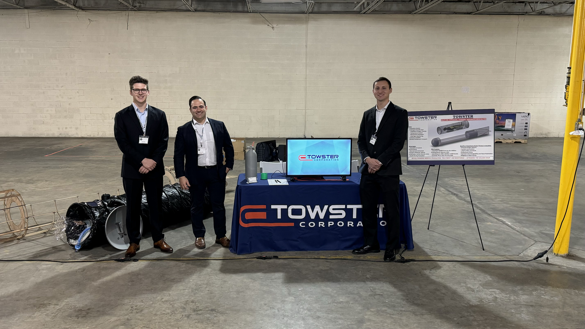

import Clayton_Bromley from '@/images/team/Clayton_Bromley.jpg'

export const article = {
  date: '2024-4-15',
  title: 'TOWSTER Corporation Presents at Duke University Startup Showcase',
  description:
    'Discover how TOWSTER Corporation wowed the audience at Duke University\'s Startup Showcase with our innovative solutions, future plans, and the exciting feedback we received from industry leaders and potential investors.',
  author: {
    name: 'Clayton Bromley',
    role: 'Chief Technology Officer',
    image: { src: Clayton_Bromley },
  },
}

export const metadata = {
  title: article.title,
  description: article.description,
}

## Setting the Stage

Student ventures took center stage at Duke Innovation & Entrepreneurship’s most exciting event of the year, The Duke Startup Showcase, where over 500 members of the entrepreneurial ecosystem gathered to witness the power of entrepreneurship at Duke.

## TOWSTER Corporation: A Fresh Perspective

Defense medical technology startup TOWSTER is pioneering casualty evacuations for clandestine denied-airspace combat scenarios while offering en route hyperbaric oxygen therapy and covert underwater evacuation capabilities.

## Highlights from Thunderstorm Showcase

Insert insights/feedback here

## Engaging Discussions and Collaborations

Throughout the conference, TOWSTER Corporation's team engaged in meaningful discussions with potential partners and numerous government representatives. The enthusiastic reception of their innovations paved the way for promising partnerships and numerous potential funding avenues.

## Looking Ahead

Insert Future Plans here

Stay tuned for more updates from TOWSTER Corporation as they continue to push the boundaries of innovation and shape the future of defense technology.

