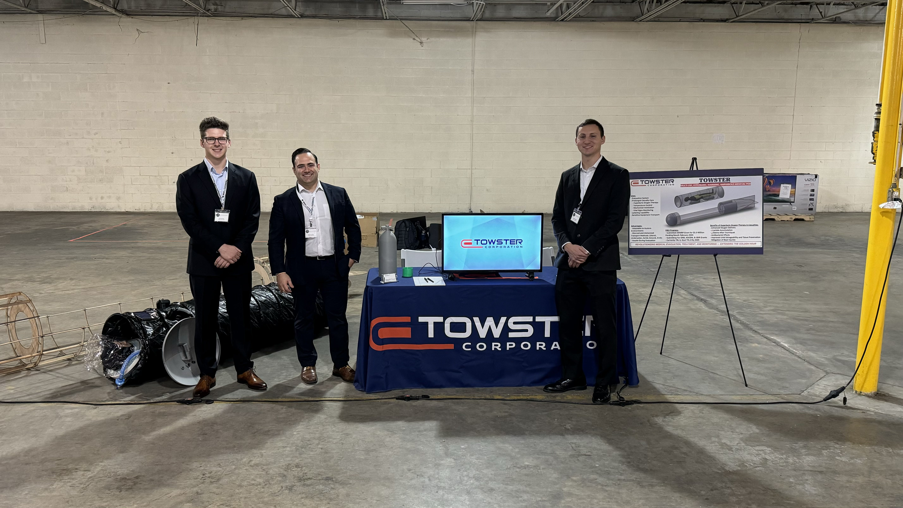

import clay from '@/images/team/clay.jpeg'

export const article = {
  date: '2023-12-25',
  title: 'TOWSTER Corporation Makes a Splash at Thunderstorm 23-5 Defense Tech Conference',
  description:
    'In the rapidly evolving world of defense technology, it\'s not often that a newcomer turns heads. Yet, from October 23-26, 2023, TOWSTER Corporation did just that at its debut appearance at the prestigious Thunderstorm 23-5 Defense Tech Conference.',
  author: {
    name: 'Clayton Bromely',
    role: 'Chief Technology Officer',
    image: { src: clay },
  },
}

export const metadata = {
  title: article.title,
  description: article.description,
}

## Setting the Stage

Located in Red Springs NC, the Thunderstorm 23-5 conference is renowned for bringing together industry leaders, innovators, and decision-makers. With a focus on cutting-edge technologies and their potential medical applications in defense, the conference provides a platform for new companies to showcase their latest advancements and collaborate on future projects.

## TOWSTER Corporation: A Fresh Perspective

TOWSTER Corporation arrived with a mission: to revolutionize the defense tech sector, particularly in medical evacuations and new applications of HBOT. Unlike previous technology, TOWSTER Pod brings a fresh perspective, blending hyperbaric oxygen technology with a commitment to security and stealth.

## Highlights from Thunderstorm Showcase

A full-scale, non-functional model of the TOWSTER Pod turned heads at the forefront of TOWSTER's display. Attendees were particularly impressed by the team in attendance and their knowledge of the problem and ability to develop effective solutions.

## Engaging Discussions and Collaborations

Throughout the conference, TOWSTER Corporation's team engaged in meaningful discussions with potential partners and numerous government representatives. The enthusiastic reception of their innovations paved the way for promising partnerships and numerous potential funding avenues.

## Looking Ahead

As TOWSTER Corporation reflects on its successful debut at Thunderstorm 23-5, the future looks bright. With a growing interest in their groundbreaking technologies and a commitment to driving change in the defense tech sector, TOWSTER is poised to make a lasting impact.

Stay tuned for more updates from TOWSTER Corporation as they continue to push the boundaries of innovation and shape the future of defense technology.

